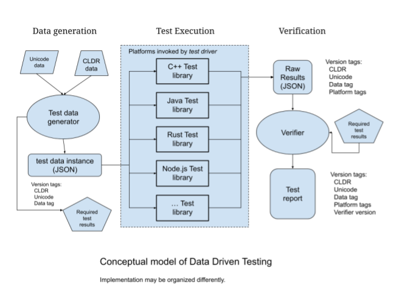

# Unicode & CLDR Data Driven Test

This repository provides tools and procedures for verifying that an
implementation is working correctly according to the data-based
specifications. The tests are implemented on several platforms including NodeJS
(JavaScript), ICU4X (RUST), ICU4C, etc. Additional programming platforms may be
added to use the test driver framework.

The goal of this work is an easy-to-use framework for verifying that an
implementation of ICU functions agrees with the required behavior. When a DDT
tet passes, it a strong indication that output is consistent across platforms.

Data Driven Test (DDT) focuses on functions that accept data input such as
numbers, date/time data, and other basic information. The specifications
indicate the expected output from implementations when given the data and
argument settings for each of the many individual data items.

Note that these tests are only part of the testing required for ICU-compliant
libraries. Many additional tests are implmeneted in the

* !!! TODO: reference to data specifications

# Components of Data Driven Test

## Architectural Overview

Conceptually, there are three main functional units of the DDT implementation:



## Data generation:

Utilizes Unicode (UTS-35) specifications, CLDR data, and existing ICU test
data. Existing ICU test data has the advantage of being already structured
towards data driven testing, is in many cases formatted in a way to simplify
adding new tests, and contains edge and error cases.

Data generation creates two files:
* Test data instance: a JSON file containing the type of test and additional
  information on the environment and version of data.

The test type is indicated with the "Test scenario" field.

Individual data tests are stored as an array of items, each with a label and
paramters to be set for computing a result.

  Example line for coll_shift_short:
  ```
  {
  "description": "UCA conformance test. Compare the first data\n   string with the second and with strength = identical level\n   (using S3.10). If the second string is greater than the first\n   string, then stop with an error.",
  "Test scenario": "coll_shift_short",
  "tests": [
    {
      "label": "0000000",
      "string1": "\u0009!",
      "string2": "\u0009?"
    },
  ```
* A required test result file (JSON) containing the expected results from each
  of the inputs. This could be called the “golden data”.

  Sample verify data:
  ```
  {"Test scenario": "coll_shift_short",
  "verifications": [
    {
      "label": "0000000",
      "verify": "True"
    },
  ```

## Text Execution:

Test execution consists of a Test Driver script and implementation-specific
executables.  The test driver executes each of the configured test
implementation executables, specifying the input test data and the location for
storing results.  STDIN and STDOUT are the defaults.

### Test executors

Each test executor platform contains a main routine that accepts a test request
from the test driver, calling the tests based on the request data.

Each executor parses the data line sent by the test driver, extracting elements
to set up the function call the the particular test.

For each test, the needed functions and other objects are created and the test
is executed. Results are saved to a JSON output file.

See [executors/README][./executors/README.md] for more details

## Verification:

Each test is matched with the corresponding data from the required test
results. A report of the test results is generated. Several kinds of status
values are possible for each test item:

* Success: the actual result agrees with expected results
* Failure: a result is generated, but the result is not the same as the expected
value.
* No test run: The test was not executed by the test implementation for the data
item
* Error: the test resulted in an exception or other behavior not anticipated for
the test case

### Open questions for the verifier:
* What should bedone if the test driver fails to complete? How can this be
  determined?

    * Proposal: each test execution shall output a completion message,
indicating that the test driver finished its execution normally, i.e., did not
crash.

# How to use DDT:

In its first implementation, Data Driven Test uses data files formatted with
JSON structures describing tests and parameters. The data directory string is
set up as follows:

## A directory testData containing:
  * Test data files for each type of test, e.g., collation, numberformat,
  displaynames, etc. Each file contains tests with a label, input, and
  parameters.
  * Verify files for each test type. Each contains a list of test labels and
  expected results from the corresponding tests.

## Directory testResults

This contains a subdirectory for each executor. The output file from each test
is store in thes appropriate subdirectory. Each test result contains the label
of the test and the result of the test. This may be a boolean or a formatted
string.

The results file contains information on the test enciroment as well as the
result from each test. Collation test results from the testResults/node file are
shown here:

```
{
  "platform": {
    "platform": "NodeJS",
    "platformVersion": "v18.7.0",
    "icuVersion": "71.1"
  },
  "test_environment": {
    "test_language": "nodejs",
    "executor": "/usr/bin/nodejs ../executors/nodejs/executor.js",
    "test_type": "coll_shift_short",
    "datetime": "10/07/2022, 16:19:00",
    "timestamp": "1665184740.2130146",
    "inputfile": "/usr/local/google/home/ccornelius/DDT_DATA/testData/coll_test_shift.json",
    "resultfile": "/usr/local/google/home/ccornelius/DDT_DATA/testResults/nodejs/coll_test_shift.json",
    "icu_version": "ICUVersion.ICU71",
    "cldr_version": "CLDRVersion.CLDR41",
    "test_count": "192707"
  },
  "tests": [
    {
      "label": "0000000",
      "result": "True"
    },
    {
      "label": "0000001",
      "result": "True"
    },
    ...
  ]
}
```

## Directory testReports
This directory stores summary results from testing by each executor. The data
files are short JSON structures with summary information on the test results. At
a minimum, each report will contain:

* The executor and test type
* Date and time of the test
* Execution informtion, from the testResults directory
* Total number of tests executed
* Total number of test failing
* Total number of tests succeeding
* Number of exceptions indeitifed in the test execution. This may include
  information on tests that could not be executed, along with the reasons
  for the problems.
* Analysis of test failures, if available. This may include summaries of string
  differences such as missing or extra characters or substitutions found in
  output data.

# History

Data Driven Test was initiated in 2022 at Google. The first release of the
package was delivered in October, 2022.

# LICENSE

See [LICENSE](./LICENSE)

```
SPDX-License-Identifier: Unicode-DFS-2016
```
